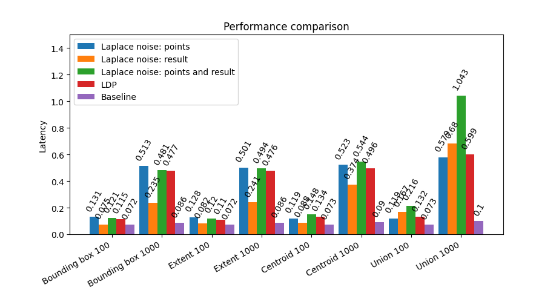

# dpgis

This library provides a proxy based on Differential Privacy (DP) for PostGIS requests. The proxy provides two options for making a reqest more private. 

The first option uses the Local Differential Privacy (LDP) algorithm as stated in [1]. Using LDP, DP is applied locally to the data of the end user and then sent to the server. In this library, it is not aggregated at the clients side, instead LDP is applied to all points affected by a query. LDP ensures that the result is differentialy private.

The second option uses Lalpace noise mechanism. The Laplace noise function offers the option to either add noise to the raw points or to the result (e.g. result of Bounding Box) or to both. In this case, there is no evidence until now, that this is truly differentially private.


## How to use

It is required to create a conda environment and install all necessary packages by running the following commands:

``` bash
conda create --name dpgis
conda activate dpgis
pip install -r requirements.txt
```

To connect the PostGIS database, the following file `database.ini` needs to be configured as followed:

```
[postgresql]
host: <the location of your PostgreSQL server>
database: <the name of your PostGIS database>
user: <username to connect to your database>
password: <password to connect to your database>
```


`config_file.py` contains the conifugration and can be modified.
Be aware that either LAPLACE_POINTS and LAPLACE_RESULT or LOCAL_DP can be [True] at a time.

```
QUERY: [<list of queries to be run>]
DATAPOINT_ATTRIBUTE: '<name of the PostGIS database column containing geometry data as a String>'
EPSILON: [<privacy parameter epsilon for Laplace/square mechanism as a float>]
LAPLACE_POINTS: [<boolean, whether to add Laplace noise to each point>]
LAPLACE_RESULT: [<boolean, whether to add Laplace noise to the result>]
LOCAL_DP: [<boolean, whether to use the square mechanism (LDP)>]
```


Once configuring is finished, the proxy is ready to be used by running the following command:

``` bash
python main.py
```

To see examples of queries currently supported by the proxy, see `query_list.txt`.

## Performance test

This library also incluces a perfomance test which calculates the average latency of different requests out of the `query_list.txt`. Each request is sent 1000 times. To calcualte the average of the latency, the highest and the lowest 10% are not considered. The execution is as follows:

``` bash
python performance_test.py
```

The performance test results in a diagram showing the different requests on the horizontal axis and the average latency on the vertical axis. The bars represent the latencies. Here is an example:




[1] D. Hong, W. Jung and K. Shim, "Collecting Geospatial Data with Local Differential Privacy for Personalized Services," 2021 IEEE 37th International Conference on Data Engineering (ICDE), 2021, pp. 2237-2242, doi: 10.1109/ICDE51399.2021.00230.